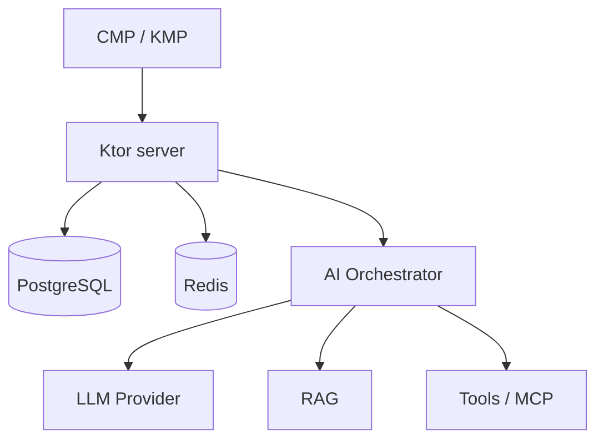
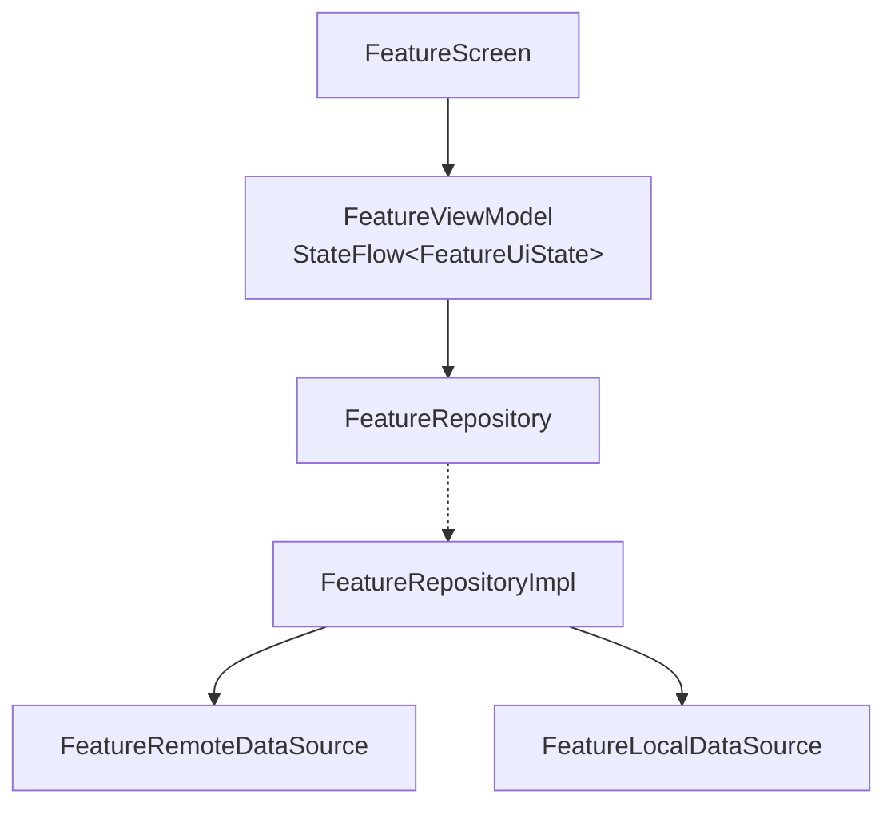
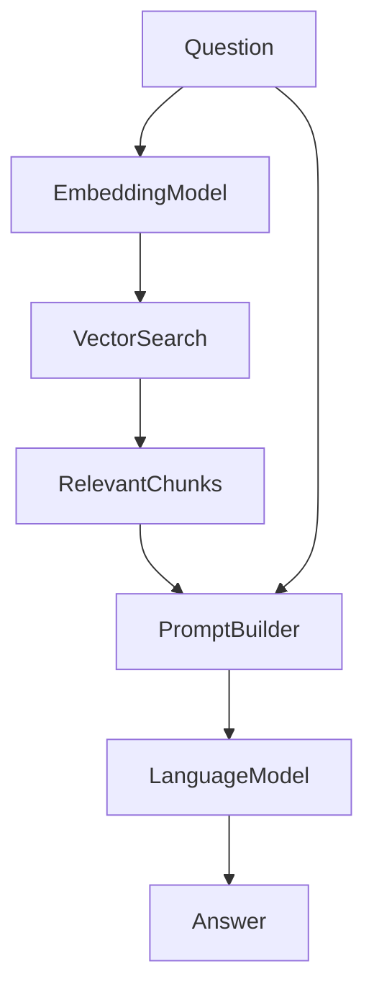

# Architecture

```mermaid
flowchart TB
    Client["CMP / KMP"]
    Backend["Ktor server"]
    DB[(PostgreSQL)]
    Redis[(Redis)]
    AI["AI Orchestrator"]
    LLM["LLM Provider"]
    RAG["RAG"]
    MCP["Tools / MCP"]
    Client --> Backend
    Backend --> DB
    Backend --> Redis
    Backend --> AI
    AI --> LLM
    AI --> RAG
    AI --> MCP
```

## Common feature

Each feature keeps presentation, domain, and data in one module.

```mermaid
flowchart TB
    Screen["FeatureScreen"]
    VM["FeatureViewModel<br/>StateFlow&lt;FeatureUiState&gt;"]
    Repo["FeatureRepository"]
    Impl["FeatureRepositoryImpl"]
    Remote["FeatureRemoteDataSource"]
    Local["FeatureLocalDataSource"]
    Screen --> VM
    VM --> Repo
    Repo -.-> Impl
    Impl --> Remote
    Impl --> Local
```

```mermaid
flowchart TD
    Question["Question"]
    EmbeddingModel["EmbeddingModel"]
    VectorSearch["VectorSearch"]
    RelevantChunks["RelevantChunks"]
    Question["Question"]
    PromptBuilder["PromptBuilder"]
    LanguageModel["LanguageModel"]
    Answer["Answer"]

    Question --> EmbeddingModel
    EmbeddingModel --> VectorSearch
    VectorSearch --> RelevantChunks
    RelevantChunks --> PromptBuilder
    Question --> PromptBuilder
    PromptBuilder --> LanguageModel
    LanguageModel --> Answer
```

